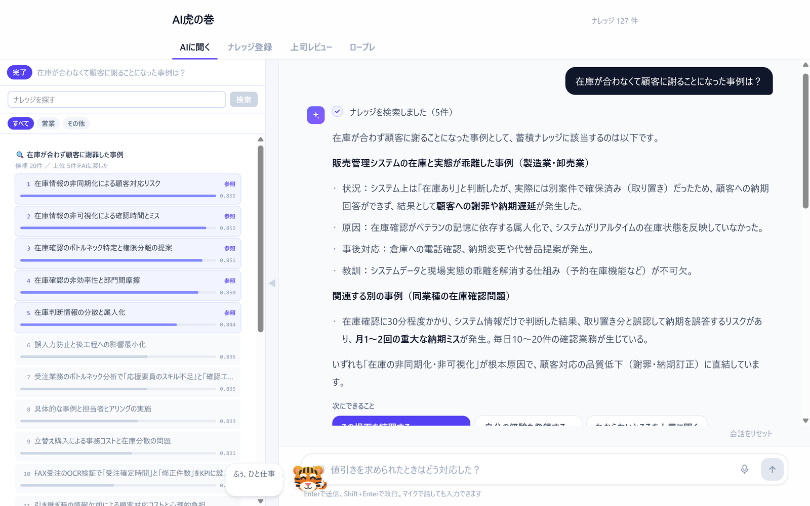
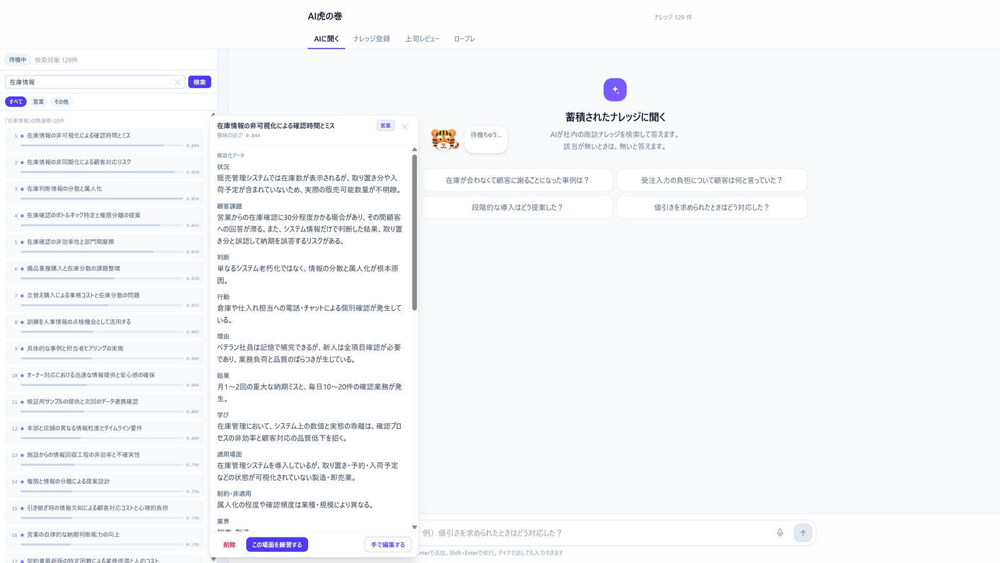
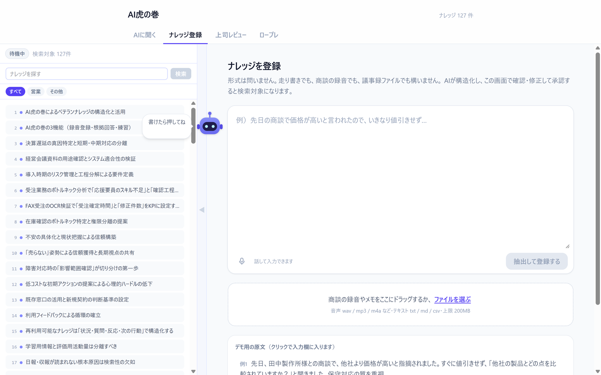
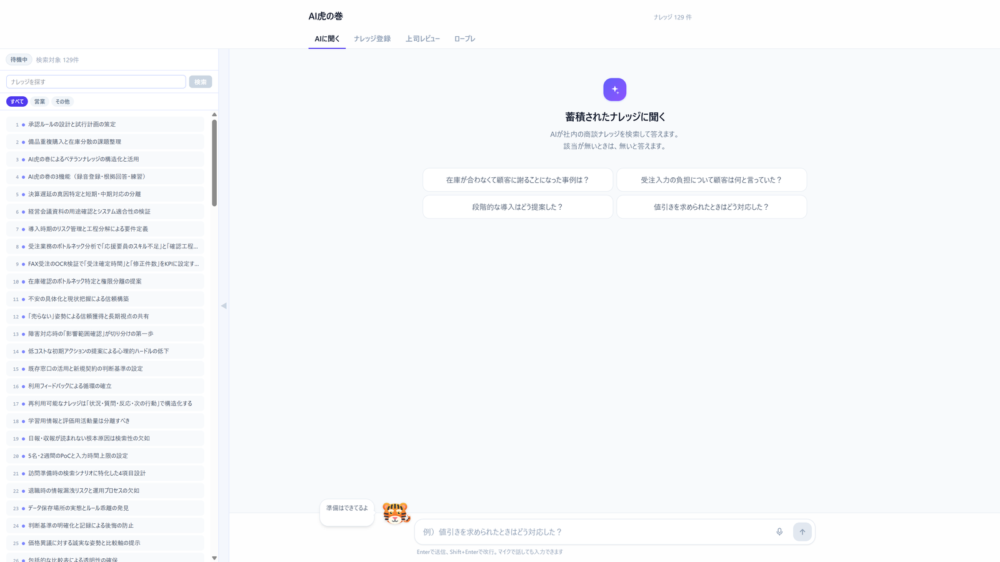
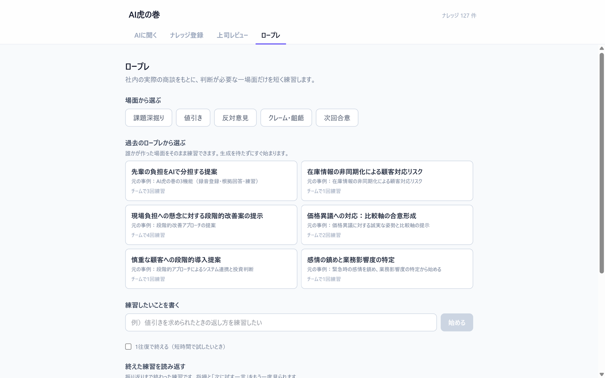
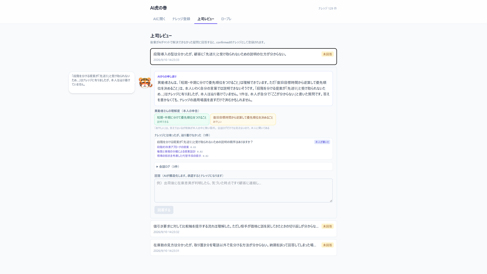

# AI虎の巻 — torano-maki

営業ナレッジをAI利活用前提の構造で蓄積し、探索・ロープレに活かすプロダクト

> 株式会社大塚商会主催「8Daysインターンシップ 〜AIエージェント開発コース〜」
> 4人チーム（Dチーム）での開発成果物



---

## 背景と課題

これまで社員が作成した日報は「ためるだけ」で、必要なときに引き出せていなかった。

- **先輩側** — 後輩指導の時間が取れず、自分のノウハウを言語化できていない
- **新人・異動者側** — 何を誰に聞けばいいか分からず、聞きに行くこと自体に躊躇がある

## アプローチ

商談録音・AIヒアリング・テキストを入力とし、LLMで**構造化されたナレッジ単位**に変換して蓄積する。
蓄積されたナレッジは、検索とロープレを通じて再利用される。

```
ためる  →  整える  →  使う  →  回す
入力コスト   構造化抽出   探索・      貢献の
ほぼゼロ     スキーマ化   ロープレ    可視化
```

「構造化されたナレッジ単位」とは、次のように**状況・判断・行動・理由・結果・学び**まで
分解された1件を指す。適用場面と**制約・非適用**を持たせているのは、
再利用するときに「この事例は自分の案件に当てはまるか」を読み手が判断できるようにするため。



---

## 主要機能

### ためる — ナレッジ蓄積

形式を問わず投入できることを優先した。走り書き、商談の録音、議事録ファイルのいずれでもよい。
LLMが構造化し、**人が画面で確認・修正して承認したものだけが検索対象になる。**



音声は文字起こしとナレッジ化の2段に分け、間に人の確認を挟んでいる。
文字起こしの欠落や幻覚は後段のLLMでは検知できないため（[理由](docs/decisions.md)）。

### 使う — ナレッジ探索

ベクトル検索と語彙検索を RRF で統合したハイブリッド検索で候補を集め、
LLMが**出典つきで**回答する。該当が無いときは「無い」と答える。



冒頭の画面がその回答結果で、左パネルに候補とスコア、回答中の各記述に参照元が紐づく。

### 回す — ロープレ

蓄積されたナレッジから顧客ペルソナと場面を生成し、判断が必要な一場面だけを短く練習する。
他の人が作った場面をそのまま再利用することもできる。



### つなぐ — 上司レビュー

分からないことを上司に送る前に、**AIが後輩役から先に聞き取る。**
「何が分からないか」が整理された状態で届くため、上司の回答コストが下がる。



上司に届くのは質問文だけではない。本人が**「説明できる」と答えた項目**と
**「あやしい」と答えた項目**が分けて表示され、さらに
**「ナレッジには有ったが、本人が辿り着けなかった」もの**が照合結果として並ぶ。
最後のケースは上司が書いて答える必要がなく、既存ナレッジの見つけ方を直せば済む。

上司の回答も下書き → 確認 → 承認を通り、そのままナレッジとして蓄積される。

---

## システム構成

```
ブラウザ   React + TypeScript / Vite / Tailwind CSS v4
   │  REST
   ▼
API       FastAPI + Pydantic + SQLAlchemy
   │
   ├─ 埋め込み ──→ sentence-transformers（各PCのCPU）
   │                 multilingual-e5-large / 1024次元
   │
   ├─ 文字起こし ─→ faster-whisper（DGX Spark）
   │                 medium / CUDA float16 / OpenAI互換API
   │
   ├─ 生成・抽出 ─→ vLLM（DGX Spark）
   │                 Qwen3.8-27B-NVFP4 / OpenAI互換API
   ▼
DB        PostgreSQL 17 + pgvector + pg_trgm
          ベクトル検索（1024次元）と語彙検索を RRF で統合
```

GPUは貸し出しのDGX Sparkで、サーバ構成をこちらで選べない前提だった。
そのため**推論はすべてOpenAI互換APIの向こう側に置き**、アプリ側は差し替え可能にしている。

## 技術構成

| 層 | 技術 | 選定理由 |
|---|---|---|
| LLM推論 | DGX Spark 上の vLLM（OpenAI互換API / `Qwen3.8-27B-NVFP4`） | GPUは貸し出しで、こちらでサーバを選べない |
| 音声認識 | DGX Spark 上の faster-whisper（`medium` / CUDA `float16`） | OpenAI互換APIをLAN共有し、各PCから利用する |
| 埋め込み | sentence-transformers / `multilingual-e5-large`（1024次元） | 日本語対応の埋め込みを各自のCPUで実行 |
| バックエンド | FastAPI / Pydantic / SQLAlchemy | スキーマ定義がLLM・DB・APIの型を兼ねる |
| フロントエンド | Vite / React / TypeScript / Tailwind CSS v4 | SPAに徹し、バックエンドと責務を分離 |
| データストア | PostgreSQL 17 + pgvector + pg_trgm | 構造化データとベクトルを同一トランザクションで扱う |
| 環境 | Docker Compose（DBのみ）/ uv / npm | OS差の出るDBだけコンテナ化し、開発体験を優先 |

---

## 設計上の判断

判断の経緯はすべて [`docs/decisions.md`](docs/decisions.md) に記録している。
以下はその抜粋。

**スキーマの正を1箇所に固定し、`create_all()` を使わない**
DDLの正は `docker/initdb/02_schema.sql` に置き、SQLAlchemyはクエリ用と割り切った。
DDLが2箇所にあると必ず食い違うため。ズレは `/health/db` で検知できるようにしている。

**日本語では PostgreSQL 標準の全文検索が機能しない**
`to_tsvector` が句点までを1トークンにしてしまい、`tsquery` がそもそもヒットしない
（PostgreSQL 17.11 で実測）。調整の問題ではないため `pg_trgm` の `word_similarity()` に切り替えた。

**検索スコアを足さず、RRF で統合する**
ベクトル距離と文字トライグラム一致度は尺度が違い、足しても比べても意味がない。
順位だけを使う Reciprocal Rank Fusion で統合している。

**語彙検索は、確信が持てないときに何も返さない**
閾値を下回る候補を返すと、無関係なナレッジがRRFの上位に混入して回答が汚れる。
「0件」を正常な結果として扱う設計にした。

**非同期ジョブ化をやめ、同期処理に戻した**
当初は「音声処理をHTTPリクエスト内で完結させない」と定めていたが、その根拠は
CPUで8分50秒の音声に7分29秒かかった実測値だった。DGX上に音声認識サーバが立ち、
**同じ音声が31秒**になった時点で前提が崩れたため、`jobs` テーブルを追加せず同期処理に決め直した。
移行が必要になったときに関数をそのまま `BackgroundTasks` へ渡せる形にはしてある。

**「渡し忘れても動いてしまう」引数を作らない**
`e5` 系の埋め込みは `passage: ` / `query: ` のプレフィックスが要るが、
付け忘れてもエラーにならず精度だけが落ちる。音声認識の用語集も同じ性質で、
無しでは `FAX` と `Excel` が1つも取れない（実測）。
どちらも呼び出し側が意識しなくてよい形に閉じ込めた。

---

## 商談データについて

**このリポジトリに含まれる商談データは、すべて架空のものである。**
実在の商談記録・顧客情報・社内資料は一切含まない。

| 種別 | 作り方 |
|---|---|
| 商談台本（22件） | ChatGPT で作成（[`tts-demo/prompts/script_prompt.md`](tts-demo/prompts/script_prompt.md)） |
| 商談音声 | 上記台本を Google Cloud の Gemini TTS で2話者の音声に合成 |
| 文字起こし | 合成音声を faster-whisper にかけた出力（[`experiments/knowledge-extraction/input/transcripts/`](experiments/knowledge-extraction/input/transcripts/)） |

登場する企業・人物・会話内容に実在のモデルはない。
文字起こしに誤変換が残っているのは、音声認識の実際の出力をそのまま保存しているため。

音声認識に渡す用語集（`GLOSSARY`）にのみ、実在の商品名を含めている。
**業務システムの商品名は音声認識が最も間違えやすく、用語集の効果を測るには
実在の固有名詞が必要だったため。** いずれも公開されている商品名であり、
実運用では製品マスタ・顧客マスタから組み立てる想定であることを
[`backend/app/services/transcription.py`](backend/app/services/transcription.py) にコメントとして残している。

---

## 開発体制

4人チーム。2026-08-20 〜 08-28 の稼働7日間で 159 コミット、Pull Request 57 件。

| 項目 | 規模 |
|---|---|
| バックエンド | 7,827 行（Python） |
| フロントエンド | 9,627 行（TypeScript / React） |
| テスト | 4,654 行 |
| APIエンドポイント | 36 |
| テーブル | 10 |

短期間で4人が並行して作業するため、**開発ルールを [`CLAUDE.md`](CLAUDE.md) に明文化した。**
ファイル単位の担当割り、`main` への直接コミット禁止、`main` の取り込み手順、
ロックファイルが競合したときの扱いまでを含む。APIとservicesを機能ごとに分割しているのも、
同じファイルを同時に編集しなくて済むようにするため。

- [@takahiro44](https://github.com/takahiro44)（[@bp22029](https://github.com/bp22029) と同一人物。期間中に2つのアカウントからコミットしている）
- [@Ry0Yamaguchi](https://github.com/Ry0Yamaguchi)
- [@firotty](https://github.com/firotty)
- [@yuka-kondo-1118](https://github.com/yuka-kondo-1118)

---

## ドキュメント

| ファイル | 内容 |
|---|---|
| [`docs/development.md`](docs/development.md) | セットアップ手順・開発ルール・ディレクトリ構成 |
| [`docs/decisions.md`](docs/decisions.md) | 技術選定と設計判断の理由 |
| [`docs/setup-notes.md`](docs/setup-notes.md) | 環境構築でハマった内容と解決策 |
| [`CLAUDE.md`](CLAUDE.md) | AIコーディング支援に与えた開発ルール |

## 公開について

インターンシップの成果物をポートフォリオとして公開しているもので、
再利用・再配布は想定していない。著作権は開発した4名に帰属する。
