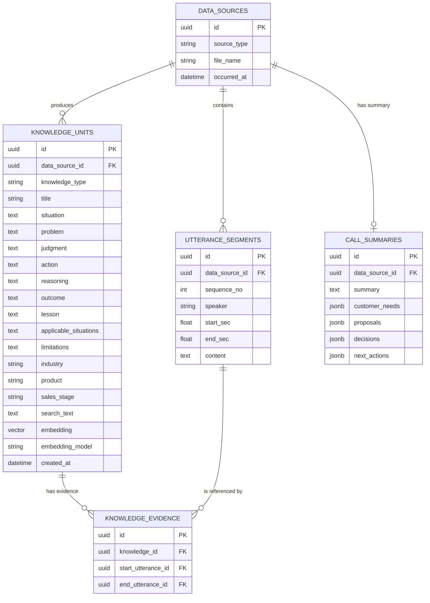
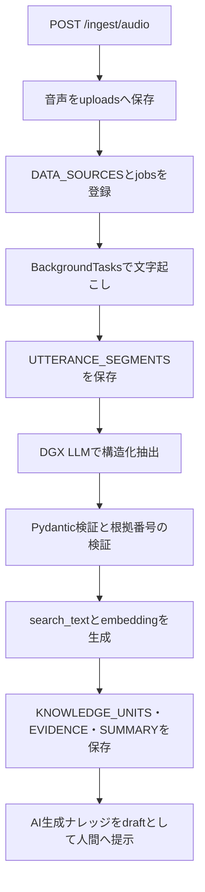

# 音声文字起こしからのナレッジ抽出設計（検証済みv0）

## この文書の位置付け

2026-08-24に `sales_demo_perturn.wav` の文字起こしをDGX Spark上の
`Qwen3.8-27B-NVFP4` へ渡し、構造化ナレッジを生成できた時点の設計を残す。

これはFastAPI・DBへ実装するための引き継ぎ資料であり、確定済みの本番DDLではない。
本番へ反映するときは、`CLAUDE.md` の規則に従い、次の3か所を同時に変更する。

1. `docker/initdb/02_schema.sql`（DDLの正）
2. `backend/app/models/tables.py`（SQLAlchemy）
3. `backend/app/models/knowledge.py` などのPydanticモデル（APIの型）

検証コードの入出力契約は
[`experiments/knowledge-extraction/schema.py`](../experiments/knowledge-extraction/schema.py)、
成功例は
[`knowledge_extraction.json`](../experiments/knowledge-extraction/output/knowledge_extraction.json)
を参照する。

## 検証結果

| 項目 | 結果 |
|---|---:|
| 入力 | 8分50秒の商談音声から生成済みの文字起こし |
| 発話セグメント | 74件 |
| 話者割当 | 営業45件 / 顧客29件 |
| ナレッジ | 5件 |
| 根拠範囲 | 8件 |
| 商談要約 | 1件 |
| LLMの応答検証 | 初回で成功 |
| LLM処理時間 | 183.2秒 |

抽出された主題は、在庫データと実態の乖離、在庫判断の属人化、課題の再定義、
段階的な導入提案、現場担当者へのヒアリングだった。各ナレッジから実在する
発話区間へ辿れることを確認した。

## 検証済みER図



## 音声と文字起こしファイルの置き場

### 検証環境

検証入力は `experiments/knowledge-extraction/input/` に置き、gitには含めない。

```text
experiments/knowledge-extraction/input/
├── sales_demo_perturn.wav   # git管理しない
└── medium_glossary.json     # git管理する
```

音声は容量が大きいためgitには含めない。文字起こしは再生成に手間がかかり、
メンバーごとに内容が違うと抽出結果を比較できないため、入力を固定する目的で管理する。

生成結果とLLMの生応答は `experiments/knowledge-extraction/output/` に置く。
成功した出力 `output/knowledge_extraction.json` だけを、レビュー可能な固定サンプルとして
git管理する。生応答 `output/raw_attempt_<N>.json` は実行のたびに変わるため含めない。

### FastAPIのMVP

アップロードされたファイルは、リポジトリ直下のgit管理外ディレクトリへ保存する。

```text
uploads/
└── <data_source_id>/
    ├── source.wav
    └── transcript.json    # 再処理・調査用。保持する場合だけ
```

- パスには利用者が送ったファイル名を直接使わず、サーバが生成したUUIDを使う。
- 元のファイル名は `DATA_SOURCES.file_name` に表示用メタデータとして保存する。
- 正規化後の文字起こしの正は `UTTERANCE_SEGMENTS` とする。
- `transcript.json` は再処理や障害調査に必要な場合だけ原本として保持する。
- 音声の保存期間と削除条件は未決定。少なくとも人間の確認が終わるまでは、
  抽出結果と照合できるよう保持する案が安全である。
- 複数台構成や本番運用ではローカルディスクでなくオブジェクトストレージへ移す。

現在の `DATA_SOURCES` には保存先を表す列がない。音声を処理後も保持するなら、
`storage_uri` または `object_key` の追加を本番スキーマ決定時に検討する。

## 入出力契約

### 文字起こし入力

`TranscriptDocument` は全文、言語、時間情報付きセグメントを受け取る。
セグメントは1から始まる `sequence_no` をサーバ側で付ける。

### LLMに生成させるもの

`LlmExtraction` は次だけをLLMに生成させる。

- 全セグメントの話者区分
- 構造化ナレッジ
- ナレッジごとの根拠となる開始・終了セグメント番号
- 商談要約、顧客ニーズ、提案、決定、次の行動

LLMにはUUIDや外部キーを生成させない。存在しないIDを生成する危険があるため、
根拠は入力に実在する `sequence_no` で返させ、アプリケーション側で
`UTTERANCE_SEGMENTS.id` に変換する。

### 保存直前の出力

`ExperimentResult` はER図の5テーブルに対応する配列を持つ。

| JSONキー | 保存先 |
|---|---|
| `data_sources` | `DATA_SOURCES` |
| `utterance_segments` | `UTTERANCE_SEGMENTS` |
| `knowledge_units` | `KNOWLEDGE_UNITS` |
| `knowledge_evidence` | `KNOWLEDGE_EVIDENCE` |
| `call_summaries` | `CALL_SUMMARIES` |

`search_text` はナレッジの各テキスト項目を連結してアプリケーション側で生成する。
`embedding` はDGXではなく、既存方針どおり各開発PCまたはバックエンドのCPU上で
`intfloat/multilingual-e5-large` を使って生成する。

## FastAPIへ移すときの処理フロー



想定する責務分担は次のとおり。

| 場所 | 責務 |
|---|---|
| `backend/app/api/ingest.py` | アップロード受付、ジョブID返却、状態取得 |
| `backend/app/services/transcription.py` | 音声から時間情報付きセグメントを生成 |
| `backend/app/services/extraction.py` | DGX呼び出し、JSONパース、検証、リトライ |
| `backend/app/services/embedding.py` | `search_text` の埋め込み生成 |
| `backend/app/models/` | API・LLM・DB境界のPydantic/SQLAlchemyモデル |
| `docker/initdb/02_schema.sql` | テーブル、制約、インデックスの定義 |

音声処理とLLM処理はHTTPリクエスト内で完了させず、既存方針どおり
`BackgroundTasks + jobsテーブル` で実行する。

## DB実装時に必要な制約

ER図をDDLへ移す際は、少なくとも次を検討する。

- `UTTERANCE_SEGMENTS (data_source_id, sequence_no)` の一意制約
- `start_sec >= 0`、`end_sec > start_sec` のチェック制約
- `CALL_SUMMARIES.data_source_id` の一意制約
- 根拠の開始・終了発話が同じ `DATA_SOURCES` に属することのアプリケーション検証
- `knowledge_type`、`speaker`、`sales_stage` の許可値
- 参照元を削除するときのFK削除方針
- `embedding` の次元が1024であること
- AI抽出結果を既存方針どおり `draft` とし、人間の確認後に検索対象へする状態管理

最後の状態管理は現在のER図にはないが、既存の `KnowledgeStatus` と整合させる必要がある。

## 現時点の制約と未決事項

- 話者は音響的な話者分離ではなく、文字起こしの文脈からLLMが推定している。
- 商談日時が入力にないため、検証では音声ファイルの更新日時を `occurred_at` に使った。
- LLM出力の事実性は自動判定できない。UIから根拠発話へ辿れる必要がある。
- 音声・生文字起こしの保存期間と削除条件が未決定。
- `DATA_SOURCES.storage_uri`、処理状態、エラー情報をどのテーブルに置くか未決定。
- 現行の単一 `knowledge` テーブルから新ERへ移行する方法は未決定。
- JSON Schema強制の有無に依存せず、パース・Pydantic検証・リトライは残す。

これらを決定してから本番DDLを変更する。検証用のスキーマをそのまま本番の正として
コピーしないこと。
