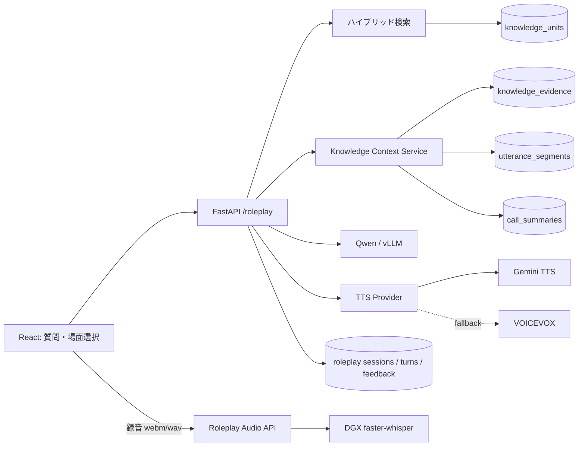

# 実装計画: 根拠付きマイクロロープレ MVP

対象リポジトリ: `torano-maki`

作成日: 2026-08-26

対象機能: 後輩が質問・選択した一場面だけを練習し、実在する発話根拠に基づいて学習・フィードバックを受ける

主な担当領域: ロープレ / フロントエンド / 音声連携 / スキーマ

---

## 1. 目的

既存の「音声 → STT → Qwenによるナレッジ抽出 → DB → 検索・AIチャット」に、次の学習体験を追加する。

```text
後輩が質問する、または練習したい場面を選ぶ
    ↓
確認済みナレッジを検索する
    ↓
Knowledge に紐づく Evidence と前後の発話セグメントを取得する
    ↓
Qwen が1〜3分の練習シナリオを作る
    ↓
後輩がテキストまたは音声で回答する
    ↓
Qwen が顧客役として1〜2回応答する
    ↓
社内事例の発話根拠と比較したフィードバックを返す
```

本機能は商談全体を最初から最後まで再現するものではない。値引き要求、課題の深掘り、反対意見、クレーム、次回合意など、**判断が必要な一場面だけを短時間で反復するマイクロロープレ**をMVPとする。

### 完成時の一文

> AIに営業の疑問を質問すると、回答を読むだけでなく、その場面を社内の実例に基づいてすぐ練習できる。

---

## 2. 現在の資産と採用方針

| 領域 | 現在の資産 | 本計画での使い方 |
|---|---|---|
| ロープレ文章生成 | DGX上のQwen / vLLM OpenAI互換API | シナリオ生成、顧客役、最終フィードバックに使う |
| STT | DGX上に常駐するfaster-whisperサーバ | 後輩の短い音声回答を文字列へ変換する。既存 `transcribe()` を再利用する |
| TTS | Google Cloud TTSの `gemini-3.1-flash-tts-preview` へADCで接続済み | MVPの第一候補。顧客役の短い返答だけを1発話ずつ合成する |
| TTS代替 | VOICEVOX APIを検討中 | Gemini TTSが利用できない環境の代替。MVPで2方式を同時完成させない |
| 検索 | E5 + pg_trgm + RRF | 質問・カテゴリに近い confirmed Knowledge を選ぶ |
| 発話DB | `utterance_segments` | 練習場面の前後文脈、根拠発話、時刻、将来の音声再生位置に使う |
| 根拠DB | `knowledge_evidence` | Knowledge と発話範囲を結び、Qwenに存在しない根拠を作らせない |
| 商談要約 | `call_summaries` | 場面だけでは不足するときの顧客・案件背景に使う |
| AIチャット | Qwen Agent + Knowledge/Evidence/Context Tool | 「この場面を練習する」入口と、文脈取得処理の再利用元にする |

### TTSの決定

MVPでは、既に疎通と音声生成が確認できている Gemini TTS を第一候補とする。VOICEVOXは切替可能な境界だけ先に定義し、Gemini TTSでデモ要件を満たせない場合に差し替える。

理由:

- 2方式を同時実装すると、音声ID、出力形式、エラー処理、環境構築が二重になる。
- ロープレの価値は音声エンジンではなく、社内事例を根拠に一場面を練習できる点にある。
- TTS失敗時もテキスト表示だけでロープレを継続できるため、TTSをブロッカーにしない。

---

## 3. MVPスコープ

### 含む

- AIチャットの回答または場面カテゴリからロープレを開始
- confirmed Knowledge のハイブリッド検索
- Evidence と前後の発話セグメントを使ったシナリオ生成
- 1セッション1〜2往復の顧客役対話
- テキスト回答とマイク回答
- マイク回答への faster-whisper STT
- 顧客役の返答に対するTTS再生
- 社内事例と比較した根拠付きフィードバック
- Knowledge ID、発話番号、時刻を画面に表示
- セッション、発言、フィードバックのDB保存
- 同じ場面への「もう一度挑戦」

### 含まない

- 商談全体の長時間ロープレ
- 商談中のリアルタイムコーチング
- カメラ・表情・感情の分析
- ユーザー認証、社員マスタ、権限管理
- 個人ランキング、管理者向け人事評価
- LLMの追加学習・ファインチューニング
- 複数TTSプロバイダーの同時完成
- ストリーミング音声会話

---

## 4. ユーザー体験

### 4.1 開始経路

MVPでは次の2経路を実装する。

1. **AIチャットから開始**
   - 後輩が「値引きを求められたらどう返すか」と質問する。
   - AI回答の参照Knowledgeごとに「この場面を練習する」ボタンを表示する。
   - ボタンから `knowledge_id` と元の質問を渡してセッションを作る。

2. **場面カテゴリから開始**
   - 「課題深掘り」「値引き」「反対意見」「クレーム」「次回合意」から選ぶ。
   - カテゴリ名を検索クエリに変換し、関連Knowledgeを自動選択する。

将来は、自分の商談からAIが弱点を推薦する経路を追加する。MVPでは実装しない。

### 4.2 1回の練習

1. 状況カードを表示する。
   - 顧客像
   - 商談フェーズ
   - 直前までの会話要約
   - 今回の目標
2. 顧客の最初の発言をテキストと音声で提示する。
3. 後輩がテキスト入力または録音する。
4. 録音時はSTT結果を表示し、誤認識なら送信前に修正できるようにする。
5. Qwenが顧客役として返答する。
6. 最大2往復、または利用者の「振り返る」で終了する。
7. フィードバックを表示する。
   - できていた点
   - 不足していた点
   - 次に試す一言
   - 参照した社内事例
   - 元の発話と時刻
   - 適用条件・非適用条件
8. 「同じ場面でもう一度」または「別の場面へ」を選ぶ。

### 4.3 フィードバックの原則

- 「共感力82点」のような根拠のない総合点を主役にしない。
- Knowledge の `judgment`、`action`、`reasoning`、`outcome`、`limitations` と比較する。
- 元データに無い事実、顧客属性、成果をQwenに補わせない。
- 引用元IDはQwenに生成させず、サーバが実際に渡したKnowledge/Evidenceから組み立てる。
- 成功例の模倣だけでなく、「この条件では使えない」も表示する。

---

## 5. 全体アーキテクチャ



### サービス境界

| サービス | 責務 |
|---|---|
| `services/roleplay.py` | セッション生成、ターン進行、終了条件、Qwenプロンプト |
| `services/knowledge_context.py` | Knowledge、Evidence、発話前後、商談要約をIDで安全に取得 |
| `services/transcription.py` | 音声からテキストへの唯一の入口。既存を変更せず再利用 |
| `services/speech_synthesis.py` | テキストから音声への唯一の入口。プロバイダー差を隠す |
| `services/llm_client.py` | Qwenへの汎用チャット呼び出し。既存を再利用 |
| `api/roleplay.py` | HTTP入力検証、例外の502/503変換、レスポンス返却 |

`agent_tools.py` の `_get_knowledge_evidence` などのprivate関数をロープレから直接importしない。共通ロジックを `knowledge_context.py` に切り出し、AIチャットのToolとロープレの両方から利用する。

---

## 6. 発話セグメントDBの利用方法

発話セグメントは次の4用途で使う。

1. **出題前の文脈**: Evidenceの開始発話より前を2〜4件取得し、「今どんな商談場面か」をQwenへ渡す。

2. **顧客の最初の発言**: Evidence内または直前・直後から、練習を開始する顧客発言を選ぶ。Qwenが新規作成する場合も、元発言から意味を変えない。

3. **フィードバックの根拠**: Knowledgeの抽象化された学びだけでなく、営業が実際にどう言ったかを表示する。

4. **元音声への導線**: `start_sec` / `end_sec` を使い、将来音声保存が可能になったときに該当箇所を再生する。MVPでは音声原本を保存していないため、時刻表示までを必須とする。

### 現状の注意点: speakerがunknown

現在のfaster-whisper経路は話者分離を行わず、`utterance_segments.speaker` に `unknown` を保存する。ロープレでは営業と顧客の区別が必要なため、次の順で解消する。

1. 20本の合成データでは、台本JSONの `turns[].speaker` を正解データとして保持する。
2. Qwenへ番号付きセグメントを渡し、`sequence_no -> salesperson/customer/other/unknown` の話者ラベルを構造化出力させる。
3. 自信がない発話は `unknown` のまま残し、ロープレ開始発話には使わない。
4. 将来、実音声を扱う場合は人が話者ラベルを修正できるUIを追加する。

話者名を推測で埋めたままconfirmedにしない。

### 段階的な根拠精度改善

現在の音声UIは、STTセグメントを連結した本文を `/ingest/text` へ渡し、文字位置からEvidence範囲を対応付けている。MVPの初期版は既存Evidenceを利用してよいが、20本データを有効活用するため、次の改善を後続PRで行う。

```text
data_source_id
    ↓
番号・話者・時刻つきutterance_segmentsを取得
    ↓
QwenがKnowledgeと evidence_start_sequence_no / evidence_end_sequence_noを返す
    ↓
存在するsequence_noだけをサーバが検証してknowledge_evidenceへ保存
```

これにより、連結本文の編集やチャンク境界にEvidenceが左右されず、発言単位の根拠をそのままロープレへ使える。

---

## 7. Qwenの責務と出力契約

Qwenの役割を3つに分ける。1つの巨大なAgentプロンプトにまとめない。

### 7.1 シナリオ生成

入力:

- 利用者の質問またはカテゴリ
- 選択済みKnowledge最大3件
- KnowledgeごとのEvidence
- Evidence前後の発話
- 必要な場合だけCallSummary

出力例:

```json
{
  "title": "値引き要求の背景を確認する",
  "situation": "在庫管理システムの提案中。顧客は他社より高いと感じている。",
  "learner_goal": "値引きに答える前に、価格が問題になる背景を質問する。",
  "customer_persona": "慎重な業務部長。費用対効果を重視する。",
  "opening_line": "他社より二十万円高いですよね。値引きできませんか。",
  "max_turns": 2,
  "rubric": [
    {"key": "clarify_reason", "label": "値引き要求の背景を確認した"},
    {"key": "connect_value", "label": "顧客課題と価値を結びつけた"},
    {"key": "next_action", "label": "次の行動を合意した"}
  ]
}
```

Knowledge ID、Evidence ID、発話番号はQwenの出力に含めず、サーバ側でセッションへ紐づける。

### 7.2 顧客役

- シナリオとそれまでのターンだけを渡す。
- 1回の返答は1〜3文、最大200文字程度に制限する。
- 模範解答を顧客側から漏らさない。
- 顧客人格を途中で変えない。
- 最大ターンを超えたら会話を引き延ばさない。
- 社内事例の固有名詞・機密情報をそのまま発話しない。

通常のチャット補完を使い、Tool Callingは行わない。検索はセッション作成時にサーバ側で済ませる。

### 7.3 フィードバック

入力:

- シナリオのrubric
- 後輩の全発言
- 顧客役の応答
- 選択済みKnowledge
- Evidence発話

出力:

- rubricごとの `met / partial / not_met`
- できていた点
- 改善点
- 次に試す一言
- 再挑戦時に意識する1点

出典一覧はサーバ側で付与する。Qwenが返した出典IDを信用しない。

---

## 8. API設計案

### `POST /roleplay/sessions`

質問・カテゴリ・AIチャットのCitationからセッションを作る。

```json
{
  "query": "値引きを求められたときの対応を練習したい",
  "knowledge_id": null,
  "category": "price_objection"
}
```

`knowledge_id` が指定された場合はそのconfirmed Knowledgeを優先する。指定がない場合は `query` と `category` からハイブリッド検索する。Evidenceが無いKnowledgeだけが見つかった場合は、根拠不足として別候補を選ぶ。

レスポンス:

- `session_id`
- 状況、目標、顧客像、最初の発言
- 参照Knowledgeのタイトル
- `max_turns`

### `POST /roleplay/sessions/{session_id}/turns/text`

後輩のテキスト回答を保存し、Qwenの顧客返答を返す。

### `POST /roleplay/sessions/{session_id}/turns/audio`

`multipart/form-data` で短い音声を受け取る。

1. 一時ファイルへ保存する。
2. 既存 `transcribe()` を呼ぶ。
3. STT結果を返す。
4. 利用者が画面で修正後、`turns/text` へ送る。
5. 生音声は保存せず削除する。

音声エンドポイント内で顧客返答まで生成しない。STT誤認識を直せる段を残すためである。

### `POST /roleplay/sessions/{session_id}/feedback`

現在までのターンから最終フィードバックを生成・保存する。

### `POST /roleplay/speech`

```json
{
  "text": "他社より二十万円高いですよね。",
  "voice": "customer_default"
}
```

音声バイナリを `audio/wav` で返す。フロントはBlob URLを作って再生し、永続保存しない。TTSが失敗した場合はテキストを表示したまま再試行可能にする。

### `GET /roleplay/sessions/{session_id}`

画面再読込とデバッグ用に、シナリオ、ターン、フィードバック、参照Knowledgeを返す。

---

## 9. DB設計案

認証を作らないため、社員IDは保存しない。MVPでは匿名の練習履歴として扱う。

### `roleplay_sessions`

| 列 | 型 | 用途 |
|---|---|---|
| `id` | UUID PK | セッションID |
| `query` | TEXT | 元の質問・カテゴリ |
| `scenario` | JSONB | 生成時点のシナリオとrubricのスナップショット |
| `status` | VARCHAR | active / completed / abandoned |
| `created_at` | TIMESTAMPTZ | 作成日時 |
| `completed_at` | TIMESTAMPTZ nullable | 完了日時 |

### `roleplay_session_knowledge`

| 列 | 型 | 用途 |
|---|---|---|
| `session_id` | UUID FK | セッション |
| `knowledge_id` | UUID FK | 実際に渡したKnowledge |
| `rank` | INT | 検索順位 |
| `usage_type` | VARCHAR | primary / supporting |

主キーは `(session_id, knowledge_id)` とする。

### `roleplay_turns`

| 列 | 型 | 用途 |
|---|---|---|
| `id` | UUID PK | 発言ID |
| `session_id` | UUID FK | セッション |
| `sequence_no` | INT | セッション内順番 |
| `role` | VARCHAR | learner / customer |
| `content` | TEXT | STT修正後または生成後の本文 |
| `input_mode` | VARCHAR | text / audio / generated |
| `created_at` | TIMESTAMPTZ | 作成日時 |

### `roleplay_feedback`

| 列 | 型 | 用途 |
|---|---|---|
| `session_id` | UUID PK/FK | 1セッション1件 |
| `rubric_result` | JSONB | met / partial / not_met と理由 |
| `strengths` | JSONB | できていた点 |
| `improvements` | JSONB | 改善点 |
| `next_phrase` | TEXT | 次に試す一言 |
| `created_at` | TIMESTAMPTZ | 作成日時 |

### 合成データの出自

20本の合成商談を実商談と区別するため、`data_sources` に次を追加する。

| 列 | 型 | 用途 |
|---|---|---|
| `origin` | VARCHAR | real / synthetic |
| `review_status` | VARCHAR | unreviewed / reviewed |

`source_type=audio` は媒体を表し、`origin=synthetic` は出自を表すため、1つの列に混ぜない。既存データは `origin=real`、`review_status=unreviewed` を既定とする。

DDL変更時はリポジトリルールどおり、次を同一PRで揃える。

1. `docker/initdb/02_schema.sql`
2. `backend/app/models/tables.py`
3. `backend/app/models/roleplay.py` のPydanticモデル

DBを作り直すため、チームへ `docker compose down -v && docker compose up -d` が必要であることを明示する。

---

## 10. TTS実装方針

### 共通インターフェース

```python
def synthesize_speech(text: str, *, voice_key: str) -> bytes:
    """短い顧客発言をWAVとして返す。"""
```

利用側はGemini/VOICEVOXを直接呼ばない。

### Gemini TTSプロバイダー

- `tts-demo/generate_tts.py` で検証済みのADC認証、モデル名、LINEAR16設定を参考にする。
- `tts-demo` をbackendから直接importしない。デモデータ生成とWeb APIでは責務・依存管理・リトライ要件が異なるためである。
- backendへ `google-cloud-texttospeech` を追加する場合は、チーム合意後に `uv add` し、`uv.lock` を更新する。
- 1回の顧客返答は200文字程度に制限し、1発話ずつ合成する。
- プロンプト読み上げや異常に長い音声を検知する既存ロジックを必要な範囲で移植する。

### VOICEVOXプロバイダー

- `audio_query` → `synthesis` のHTTP呼び出しを `httpx` で包む。
- `VOICEVOX_BASE_URL` と `VOICEVOX_SPEAKER_ID` を設定値にする。
- 利用する音声・ライセンス表示の条件をデモ前に確認する。
- Gemini TTSを選んだMVPでは、provider interfaceと設定値だけ先に決め、実装は後回しでよい。

### 設定案

```text
TTS_PROVIDER=gemini          # gemini / voicevox / disabled
TTS_GEMINI_MODEL=gemini-3.1-flash-tts-preview
TTS_GEMINI_VOICE=Algieba
VOICEVOX_BASE_URL=http://127.0.0.1:50021
VOICEVOX_SPEAKER_ID=3
```

秘密情報は `.env` にもコードにも置かず、Gemini TTSはADCを利用する。

---

## 11. 20本の台本・音声の使い方

20本は単なる検索件数ではなく、ロープレの品質評価用データセットとして設計する。

### 台本JSONに追加する推奨メタデータ

`tts-demo/import_script.py` は未知のキーを残すため、次を追加できる。

```json
{
  "case_type": "success",
  "difficulty": "beginner",
  "industry": "卸売",
  "product": "販売管理システム",
  "sales_stage": "提案",
  "turning_points": [
    {
      "id": "price_01",
      "customer_turn": 24,
      "expected_actions": [
        "値引き要求の背景を確認する",
        "顧客課題と費用対効果を結びつける"
      ],
      "anti_patterns": ["理由を聞かずに値引きする"],
      "applicable_situations": "価格差が主な懸念として提示された場面",
      "limitations": "契約期限や承認済み条件が優先される場合は別判断が必要"
    }
  ]
}
```

### 推奨する20本の内訳

| 場面 | 成功 | 失敗 | 立て直し | 例外 | 合計 |
|---|---:|---:|---:|---:|---:|
| 課題深掘り | 1 | 1 | 1 | 1 | 4 |
| 値引き | 1 | 1 | 1 | 1 | 4 |
| 反対意見 | 1 | 1 | 1 | 1 | 4 |
| クレーム・齟齬 | 1 | 1 | 1 | 1 | 4 |
| 次回合意 | 1 | 1 | 1 | 1 | 4 |

### 開発用と評価用を分ける

- 15〜16本: プロンプト・検索・UIの開発に使う。
- 4〜5本: 最後まで調整に使わないholdoutとし、抽出・検索・フィードバックを評価する。
- 全件に `synthetic=true` とレビュー状態を持たせる。実商談由来と説明しない。
- 可能なら営業経験者に、分岐点、期待行動、非適用条件だけでも確認してもらう。

---

## 12. 実装フェーズとPR分割

現在 `feat/audio-ingest` で音声取り込みが開発中である。共有ファイルの競合を避けるため、音声取り込みのPRが確定するまではロープレ側から `ingest.py`、`transcription.py`、`AudioIngest.tsx` を変更しない。

### Phase 0: 契約とデータ準備

- 20本の台本へ `turning_points` と成功/失敗/例外の種別を付ける。
- ロープレ用Pydanticスキーマを確定する。
- Gemini TTSかVOICEVOXかを1方式だけ選ぶ。
- 3本を先行生成し、STT、抽出、Evidence、ロープレ生成まで通してから残りを作る。

完了条件:

- 3本に最低1つずつレビュー可能な分岐点がある。
- ロープレのJSON Schemaをチームで合意している。

### Phase 1: 根拠取得とテキスト版シナリオ

PR例: `feat/roleplay-scenario`

- `services/knowledge_context.py` を追加する。
- `agent_tools.py` のEvidence/Context取得を共通サービスへ寄せる。
- 質問またはknowledge_idからKnowledge最大3件を選ぶ。
- Qwenで `RoleplayScenario` を生成する。
- `POST /roleplay/sessions` を実装する。
- まずDB保存なしのサービス単体テストでシナリオ生成を確認する。

完了条件:

- 質問からconfirmed Knowledgeと実在するEvidenceが選ばれる。
- シナリオにサーバが知らないKnowledge IDが混入しない。
- Evidence不足時は明示的に開始不可となる。

### Phase 2: セッション・顧客役・フィードバック

PR例: `feat/roleplay-session`

- DDL、SQLAlchemy、Pydanticを追加する。
- テキストターンAPIを実装する。
- 最大2往復の状態遷移を実装する。
- フィードバック生成と保存を実装する。
- `GET /roleplay/sessions/{id}` を実装する。

完了条件:

- active → completed の遷移がテストされている。
- 上限を超えて顧客ターンを追加できない。
- フィードバックに利用者が発言していない内容を捏造しない。
- 表示する出典はセッションに紐づくKnowledge/Evidenceだけである。

### Phase 3: 音声入出力

PR例: `feat/roleplay-voice`

- 短い音声のSTT APIを実装する。
- STT結果の確認・修正後に送るUIを作る。
- `services/speech_synthesis.py` とTTS APIを実装する。
- TTS失敗時のテキストフォールバックを実装する。

完了条件:

- ブラウザの `webm` 録音を既存faster-whisperへ送れる。
- STTの誤りを送信前に修正できる。
- 生の練習音声がサーバへ残らない。
- TTS停止中でもテキスト版ロープレが完走する。

### Phase 4: フロントエンド体験

PR例: `feat/roleplay-ui`

- `RoleplayStart`、`RoleplaySession`、`RoleplayFeedback` を追加する。
- AIチャットのCitationへ「この場面を練習する」を追加する。
- 場面カテゴリの選択画面を追加する。
- 録音、STT確認、音声再生、再挑戦を接続する。
- Qwen/TTS/STT待機中に処理内容と経過秒数を出す。

完了条件:

- 初見の利用者が説明なしで1回完走できる。
- 60〜90秒のラウンドロビン用1往復モードを用意できる。
- 根拠発話と時刻がフィードバックから確認できる。

### Phase 5: セグメント対応抽出と評価

PR例: `feat/segment-aware-extraction`

- 番号付きセグメントをQwenへ渡す抽出処理を追加する。
- QwenのEvidence番号と話者ラベルをPydanticで検証する。
- `knowledge_evidence` を実在する発話IDへ直接紐づける。
- holdoutデータで検索・根拠・ロープレ品質を評価する。

Phase 1〜4は既存Evidenceで先に動かせるため、Phase 5が遅れてもデモ全体を止めない。ただし最終的に「発言セグメントを有効活用した」と説明するには、最低でも根拠取得と時刻表示はPhase 1〜4で必須とする。

---

## 13. ファイル単位の変更予定

### 新規

- `backend/app/models/roleplay.py`
- `backend/app/services/knowledge_context.py`
- `backend/app/services/speech_synthesis.py`
- `backend/tests/test_roleplay_models.py`
- `backend/tests/test_roleplay_service.py`
- `backend/tests/test_roleplay_api.py`
- `frontend/src/components/RoleplayStart.tsx`
- `frontend/src/components/RoleplaySession.tsx`
- `frontend/src/components/RoleplayFeedback.tsx`

### 既存変更

- `backend/app/api/roleplay.py`
- `backend/app/services/roleplay.py`
- `backend/app/services/agent_tools.py`
- `backend/app/models/tables.py`
- `backend/app/config.py`
- `docker/initdb/02_schema.sql`
- `.env.example`
- `frontend/src/App.tsx`
- `frontend/src/api/client.ts`
- `frontend/src/types/api.ts`
- `frontend/src/components/chat/Citations.tsx`
  （PR #33「AIチャットをストリーミング化しUIを刷新する」で
  `frontend/src/components/AiChat.tsx` は削除され `components/chat/` へ再編される。
  「この場面を練習する」ボタンの追加先はこちらになる。
  Phase 4 は #33 のマージ後に着手すること）

### 音声取り込みPR確定後にのみ変更

- `backend/app/api/ingest.py`
- `backend/app/services/transcription.py`
- `backend/app/services/audio_ingest.py`
- `frontend/src/components/AudioIngest.tsx`

---

## 14. テスト・評価計画

### 自動テスト

- Pydanticが余分なキー、不正なrole、0件rubricを拒否する。
- confirmed以外のKnowledgeからセッションを作れない。
- EvidenceのKnowledgeとDataSourceが一致しない場合は拒否する。
- 発話範囲の開始・終了順が不正なら拒否する。
- セッションのターン順、最大ターン、完了後の追加入力を検証する。
- Qwen、STT、TTSの未設定・タイムアウト・異常応答を502/503へ変換する。
- TTS失敗がセッションを失敗状態にしない。
- 音声一時ファイルが成功・失敗の両方で削除される。

### 20本データでの評価

| 指標 | 見る内容 |
|---|---|
| STT | 固有語の誤り、発話欠落、文字起こし空欄 |
| 話者ラベル | Sales / Customer の正解率、unknown率 |
| ナレッジ抽出 | gold_knowledgeとの項目一致、過剰な推測の有無 |
| Evidence | 正解turning pointを含むか、範囲が広すぎないか |
| 検索 | 質問に対するRecall@5、同場面の成功/失敗例を拾えるか |
| シナリオ | 元事例と矛盾しないか、模範解答を先に漏らさないか |
| フィードバック | expected_actions / anti_patternsを正しく判定するか |

### 人による確認

最低5つの場面について、チーム外の人に1往復ロープレを試してもらう。

- 何をすればよいか説明なしで分かったか。
- 顧客役の返答が不自然でなかったか。
- フィードバックが次の行動に変換できたか。
- 元発話を見て納得できたか。
- もう一度試したいと思ったか。

---

## 15. 非機能要件とデモ対策

- Qwen、STT、TTSは個別にタイムアウトとエラー文言を持つ。
- シナリオ生成中、STT中、顧客応答生成中、TTS中を区別して表示する。
- 事前生成したシナリオを最低3件用意し、ラウンドロビンでは検索・生成待ちを減らす。
- ライブデモ用は1往復、通常モードは最大2往復とする。
- Qwenが停止しても見せられる画面録画を用意する。
- TTSが停止してもテキスト版で継続する。
- 生の練習音声は保存しない。保存する場合は別途、同意・保持期間・削除方法を決める。
- 合成データと実データを画面・DBで区別できるようにする。

---

## 16. 主なリスクと対策

| リスク | 対策 |
|---|---|
| Qwenが根拠にない設定を作る | 入力を最大3件に限定し、ID・Citationはサーバで付与する |
| Evidence範囲が商談全体になり教材として粗い | turning pointメタデータとセグメント番号出力へ段階移行する |
| speakerがunknownで顧客発言を選べない | 合成台本を正解データにし、Qwen話者分類と検証を追加する |
| 1ターンの待ち時間が長い | thinking OFF、最大2往復、短文制限、待機表示、事前生成 |
| TTSの課金・障害で止まる | 1発話ずつ合成、再生は任意、テキストへフォールバック |
| VOICEVOX検討で実装が分散する | MVPのTTSを1方式に固定し、provider interfaceだけ共通化する |
| 成功事例だけを正解扱いする | 失敗・立て直し・例外を同数程度用意し、limitationsを必ず渡す |
| 合成データを実データと誤認させる | synthetic表示とレビュー状態を保持する |
| 音声取り込み開発とコンフリクトする | ingest系PRの確定まで共有ファイルを変更しない |

---

## 17. MVP完了条件

次をすべて満たした時点をMVP完成とする。

- 質問またはカテゴリから1つの練習場面を開始できる。
- シナリオはconfirmed Knowledgeと実在するEvidenceに紐づく。
- 後輩がテキストまたは音声で回答できる。
- 音声回答はfaster-whisperで文字起こしし、修正後に送信できる。
- Qwen顧客と1〜2往復できる。
- 顧客発言をGemini TTSまたは選定した1方式で再生できる。
- TTSが失敗してもテキストで最後まで進める。
- フィードバックに元Knowledge、発話本文、時刻、適用条件、非適用条件が表示される。
- 同じ場面へ再挑戦できる。
- セッション、ターン、フィードバックがDBへ保存される。
- holdoutケースで、正しい場面が検索Top-5に入り、根拠発話をたどれる。
- ラウンドロビン用の1往復デモが60〜90秒程度で完了する。

---

## 18. 最初に着手する順番

1. 20本すべてを作る前に、3本へturning pointと成功/失敗/例外情報を付ける。
2. その3本を現在の音声取り込みへ通し、Knowledge、Evidence、Segmentsの状態を確認する。
3. テキスト版 `POST /roleplay/sessions` を作り、発話根拠から1場面を生成する。
4. 顧客役との1往復とフィードバックを完成させる。
5. フロントで「この場面を練習する」まで接続する。
6. STTによる音声回答を加える。
7. 最後にTTSを加える。
8. 3本で成立した設計を残り17本へ展開する。

最初から20本を生成し切らない。3本の段階で「ロープレに必要な分岐点・話者・期待行動が足りない」と判明すると、20本すべてを作り直すことになるためである。
